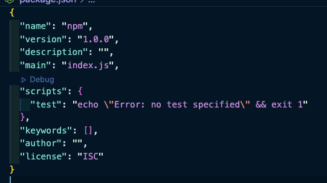

# 1. NPM

Created By: 홍익 안
Last Edited: Nov 23, 2020 10:29 PM

## 1. NPM(Node Package Manager)

NPM은 명령어로 자바스크립트 라이브러리를 설치하고 관리할 수 있는 패키지 매니저이다.

전세계 개발자들이 모두 자바스크립트 라이브러리를 공개된 저장소에 올려놓고 npm 명령어로 편하게 다운로드 받을 수 있다.

NPM은 Node.js를 설치하면 같이 설치된다!

### npm 초기화 명령어 - init

```bash
npm init -y
```



### npm 설치 명령어 - install

```bash
npm install jquery
```

node_modules 아래에 jquery 폴더가 설치된 것을 볼 수 있다.


폴더 아래에 package.json을 살펴보면 방금 설치한 jquery의 버전(3.5.1)을 볼 수 있다.


## 2. NPM을 사용하는 이유?


위의 형태로 라이브러리를 코드 중간에 불러왔을때 문제가 뭘까? 
⇒ 라이브러리가 페이지 중간에 어딘가 들어와도 돌아간다는것이 웹 개발의 유연함이다.

⇒ 그때마다 필요한 라이브러리를 소스 중간에 추가한다면 다른 사람이 개발하던 프로젝트를 이어 진행할 경우 어떤 라이브러리가 있는지 알려면 script를 다 검색하고 버전을 확인해가며 체크해야한다.

### npm을 사용한다면?

1.  프로젝트에 어떤 라이브러리를 사용하는지, 버전은 무엇인지, 의존성은 어떤지 한눈에 알 수 있다.


2. 내가 어떤 라이브러리가 필요하다?

이렇게 인터넷에서 필요한 태그를 찾아서 라이브러리를 들고오는 과정은 번거롭다


하지만 npm install을 이용한다면?

```bash
npm install jquery-ui
```

내가 원하는 프로젝트 폴더에 원하는 라이브러리를 쉽게 설치할 수 있고, 사용할 수 있다.


## 3. NPM 지역 설치 명령어와 제거 명령어

gulp라는 라이브러리를 설치하면 gulp뿐만이 아니고 gulp와 관련된 많은 라이브러리가 함께 설치된다.


```bash
npm install gulp
npm uninstall gulp
```

이후 npm uninstall을 실행하면 gulp가 삭제되면서 함께 설치했던 라이브러리도 삭제된다

## 4. NPM 전역 설치 명령어 -install —global

이번에는 gulp를 설치하면서 install 옵션에 —global을 주어 설치해보자

node_modules 폴더에 어떤 변화가 있을까?

```bash
npm install gulp --global
```

gulp가 설치되었지만, node_modules 아래에서는 찾을수 없다

그렇다면 gulp는 어디에 존재하고 있을까?


혹은 아래의 명령어를 입력하여 글로벌 모듈로 설치하는 경우의 Path를 확인할 수 있다.

```bash
npm root -g
```

npm 전역 설치는 시스템 레벨에서 사용할 자바스크립트 라이브러리를 설치할 때 사용합니다.

## NPM 지역 설치 옵션 2가지

```bash
아래의 두가지는 동일한 결과(아래가 축약)
npm install jquery --save-prod
npm i jquery

아래의 두가지는 동일한 결과(아래가 축약문법)
npm install vue --save-dev
npm i vue -D
```

설치옵션에 아무것도 넣지 않은 경우 package.json의 dependencies에 등록된다.

-D옵션으로 설치를 할 경우 devDependencies에 설치되는걸 볼수있다.


### dependencies vs devDependencies

dependencies는 애플리케이션의 로직(동작, 화면)과 직접적으로 연관이 있는 라이브러리들

devDependencies는 webpack, js-compression, sass등 개발보조 라이브러리이다.

dependencies는 배포용, devDependencies는 개발용

npm run build로 빌드를 하면 최종 애플리케이션 코드에 dependencies(배포용 라이브러리)만 포함이된다.

라이브러리를 설치할때 이렇게 안내를 해주기도 하지만, 스스로 판단해서 애플리케이션 로직에 필요한 것인지 아닌지 구분해서 설치하자.


즉 최종 애플리케이션에 포함되어야 하는 라이브러리는 D옵션으로 설치하면 안된다. 개발할 때만 사용하고 배포할 때는 빠져도 좋은 라이브러리의 예시는 다음과 같다.

- `webpack` : 빌드 도구
- `eslint` : 코드 문법 검사 도구
- `imagemin` : 이미지 압축 도구

출처: [https://joshua1988.github.io/webpack-guide/](https://joshua1988.github.io/webpack-guide/)