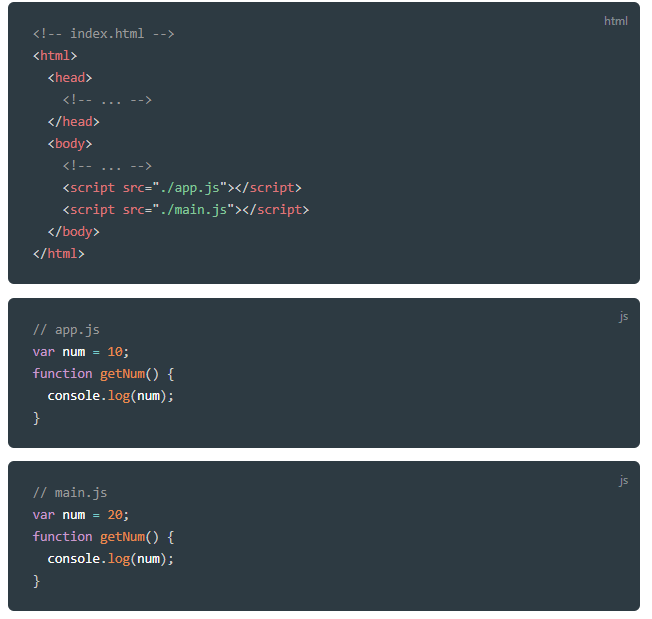

# 2. 웹팩의 등장배경

Created By: 홍익 안
Last Edited: Nov 24, 2020 4:22 PM

## 웹팩이란?

웹팩은 최신 프런트엔드 프레임워크에서 가장 많이 사용되는 모듈 번들러이다. 모듈 번들러란 웹 애플리케이션을 구성하는 자원(HTML, CSS, Javasctipt, Image 등)을 모두 각각의 모듈로 보고 이를 조합해서 병합된 하나의 결과물을 만드는 도구이다. 

⇒ 여러개를 파일을 하나로 합친다의 개념으로 이해하자

## 모듈?

모듈은 프로그래밍 관점에서 특정 기능을 갖는 작은 코드 단위

```jsx
// math.js
function sum(a, b) {
  return a + b;
}

function substract(a, b) {
  return a - b;
}

const pi = 3.14;

export { sum, substract, pi }
```

이 `math.js` 파일은 아래와 같이 3가지 기능을 갖고 있는 모듈이다

1. 두 숫자의 합을 구하는 `sum()` 함수
2. 두 숫자의 차를 구하는 `substract()` 함수
3. 원주율 값을 갖는 `pi` 상수

이처럼 성격이 비슷한 기능들을 하나의 의미 있는 파일로 관리하면 모듈이 된다!

## 웹팩에서의 모듈

웹팩에서 모듈은 자바스크립트뿐만 아니고 웹 애플리케이션을 구성하는 모든 자원을 의미한다. 웹 애플리케이션을 제작하려면 HTML, CSS, Images, Font등 많은 파일들이 필요한데 이 파일 하나하나가 모두 모듈이다.

## 웹팩 등장 배경

### 1. 파일 단위의 자바스크립트 모듈 관리

자바스크립트의 변수 유효범위 ⇒ 기본적으로 전역 범위를 가짐

아래와 코드의 index.html에서 두 자바스크립트 파일을 로딩하여 사용하면 결과는 20이 나온다.

이러한 문제점은 복잡한 애플리케이션에서 변수의 중복 선언 문제나, 의도치 않은 값 할당의 원인이 된다.

**⇒ 자바스크립트 파일 단위로 변수를 관리, 즉 모듈화에 대한 필요성이 있었고, AMD, Common.js와 같은 라이브러리로 해결해왔다.**



### 2. 웹 개발 작업 자동화 도구

프런트엔드 개발 업무를 할 때 가장 많이 반복하는 작업

⇒ 텍스트 편집기에서 코드를 수정하고 저장한 뒤 브라우저에서 새로 고침을 눌러 변경사항을 본다

추가로 웹 서비스를 개발하고 웹 서버에 배포할 때 아래와 같은 작업들을 해야 했다.

- HTML, CSS, JS 압축
- 이미지 압축
- CSS 전처리기 변환

이러한 일들을 자동화 해주는 도구들이 필요했고, Grunt와 Gulp 같은 도구들이 등장했다.

웹팩은 이 기능에 더해서 모듈 관리까지 해준다.

### 3. 웹 애플리케이션의 빠른 로딩 속도 및 성능

웹 사이트의 로딩 속도를 높이기 위해 많은 노력들이 있었다

그 중 대표적인 노력이 브라우저에서 서버로 요청하는 파일 숫자를 줄이는 것인데, 이를 위해 앞에서 살펴본 웹 태스크 매니저를 이용해 파일들을 압축하고 병합하는 작업들을 진행했다.

또한  초기 페이지 로딩 속도를 높이기 위해 나중에 필요한 자원들은 나중에 요청하는 레이지 로딩(Lazy Loading)이 등장했다.

웹팩은 기본적으로 필요한 자원은 미리 로딩하는게 아니라 그 때 그 때 요청하자는 철학을 갖고 있다

출처: 

[https://joshua1988.github.io/webpack-guide/webpack](https://joshua1988.github.io/webpack-guide/webpack/what-is-webpack.html#%EC%9B%B9%ED%8C%A9%EC%9D%B4%EB%9E%80)