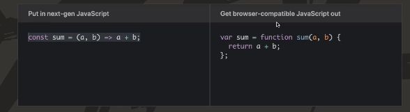

# 4. 바벨

Created By: 홍익 안
Last Edited: Nov 24, 2020 4:22 PM

바벨은 기본적으로 자바스크립의 `최신 문법들을 최대한 많은 브라우저에 호환되게끔 변환해주는 도구`이다.

왼쪽의 ES6의 문법을 오른쪽처럼 기존의 문법으로 변환해준다

[Babel · The compiler for next generation JavaScript](https://babeljs.io/)