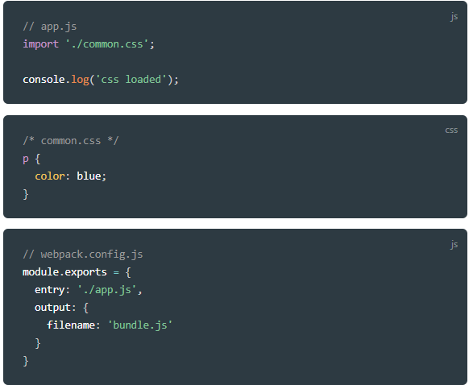

# 6. 웹팩의 4가지 주요 속성

Created By: 홍익 안
Last Edited: Nov 24, 2020 4:36 PM

## 1. Entry

웹팩에서 웹 자원을 변환하기 위해 필요한 최초 진입점이자 자바스크립트 파일 경로이다.

```jsx
// webpack.config.js
module.exports = {
  entry: './src/index.js'
}
```

이대로 설정하면 웹팩을 실행할때 src 폴더의 index.js를 대상으로 웹팩이 빌드를 수행한다.

### Entry 파일에는 어떤 내용이?

entry 파일에는 웹 애플리케이션의 전반적인 구조와 내용이 담겨져 있어야한다. 웹팩이 해당 파일을 가지고 웹 애플리케이션에서 사용되는 모듈들의 연관 관계를 이해하고 분석하기 때문에 애플리케이션을 동작시킬 수 있는 내용들이 담겨져 있어야 한다.

예를 들어, 블로그 서비스를 웹팩으로 빌드한다고 했을 때 코드의 모양은 아래와 같을 수 있다.

```jsx
// index.js
import LoginView from './LoginView.js';
import HomeView from './HomeView.js';
import PostView from './PostView.js';

function initApp() {
  LoginView.init();
  HomeView.init();
  PostView.init();
}

initApp();
```

위 코드는 해당 서비스가 spa라고 가정하고 작성한 코드이다. 사용자의 로그인 화면, 로그인 후 진입하는 메인 화면, 그리고 게시글을 작성하는 화면 등 웹 서비스에 필요한 화면들이 모두 index.js 파일에서 불려져 사용되고 있기 때문에 웹팩을 실행하면 해당 파일들의 내용까지 해석하여 파일을 빌드해줄 것!

또한 엔트리 포인트는 여러개가 될 수도 있는데, 이렇게 분리하는 경우는 spa가 아닌 특정 페이지로 진입했을때 서버에서 해당 정보를 내려주는 형태의 멀티 페이지 애플리케이션에 적합하다.

```jsx
entry: {
  login: './src/LoginView.js',
  main: './src/MainView.js'
}
```

## 2. Output

output 속성은 웹팩 결과물의 파일 경로를 의미한다.

```jsx
// webpack.config.js
module.exports = {
  output: {
    filename: 'bundle.js'
  }
}
```

최소 filename은 지정해줘야하고, 일반적으로 path 속성을 함께 정의한다.

```jsx
// webpack.config.js
var path = require('path');

module.exports = {
  output: {
    filename: 'bundle.js',
    path: path.resolve(__dirname, './dist')
  }
}
```

filename: 웹팩으로 빌드한 파일의 이름

path: 해당 파일의 경로

path.resolve(): 인자로 넘어온 경로를 조합하여 유효한 파일 경로를 만들어주는 Node.js의 API

⇒ output: './dist/bundle.js'

1. 결과 파일 이름에 `entry` 속성을 포함하는 옵션

```jsx
module.exports = {
  output: {
    filename: '[name].bundle.js'
  }
};
```

2. 결과 파일 이름에 웹팩 내부적으로 사용하는 모듈 ID를 포함하는 옵션

```jsx
module.exports = {
  output: {
    filename: '[id].bundle.js'
  }
};
```

3. 매 빌드시 마다 고유 해시 값을 붙이는 옵션

```jsx
module.exports = {
  output: {
    filename: '[name].[hash].bundle.js'
  }
};
```

4. 웹팩의 각 모듈 내용을 기준으로 생생된 해시 값을 붙이는 옵션

```jsx
module.exports = {
  output: {
    filename: '[chunkhash].bundle.js'
  }
};
```

chunkhash를 붙이면 빌드할때마다 웹팩에서 고유값을 붙여준다.

bundle.js로 변환이 되면 내부의 파일 내용과 관계없이 브라우저의 캐싱때문에 같은 파일을 뿌려준다. 이런 해시들을 활용해서 새로운 파일이름이 생성되도록하면 강제 새로고침으로 매번 캐시값을 지우지 않고도 결과물을 잘 확인할 수 있다.

## 3. Loader

로더는 웹팩이 웹 애플리케이션을 해석할 때 자바스크립트 파일이 아닌 웹 자원(HTML, CSS, Images, Font 등)들을 변환할 수 있도록 도와주는 속성

```jsx
// webpack.config.js
module.exports = {
  module: {
    rules: []
  }
}
```

### 로더가 필요한 이유

아래와 같은 코드가 있을때 웹팩으로 빌드하게 되면 오류가 발생한다.

오류의 내용은 "app.js파일에서 import한 common.css파일을 해석하기 위해 로더를 추가해라"



이때 해당 폴더에 CSS로더를 설치하고 webpack.config.js의 설정을 바꿔주면 에러를 해결할 수 있다.


위의 module파트의 코드를 보면 rules 배열에 객체 한 쌍을 추가했다. 각 속성의 의미는 다음과 같다

- test: 로더를 적용할 파일의 유형(일반적으로 정규식 사용)
- use: 해당 파일에 적용할 로더의 이름

위의 코드는 해당 프로젝트의 모든 CSS 파일에 대해서 CSS 로더를 적용하겠다는 의미이다.

### 자주 사용되는 로더의 종류

- **[Babel Loader](https://webpack.js.org/loaders/babel-loader/#root)**
- **[Sass Loader](https://webpack.js.org/loaders/sass-loader/#root)**
- **[File Loader](https://webpack.js.org/loaders/file-loader/#root)**
- **[Vue Loader](https://github.com/vuejs/vue-loader)**
- **[TS Loader](https://webpack.js.org/guides/typescript/#loader)**

로더를 여러개 추가하는 경우 아래와 같이 rules 배열에 로더 옵션을 추가하면 된다.


### 로더의 적용 순서

특정 파일에 대해 여러 개의 로더를 사용해야 하는 경우, 로더가 적용되는 순서에 주의하자! **로더는 기본적으로 오른쪽에서 왼쪽 순으로 적용된다**.


위는 scss파일에 대해 먼저 Sass 로더로 전처리(scss 파일을 css 파일로 변환)를 한 다음 웹팩에서 CSS 파일을 인식하도록 CSS 로더를 적용하는 코드이다.


만약 웹팩으로 빌드한 후 실행했을 때 해당 CSS 파일이 웹 애플리케이션에 인라인 스타일 태그로 추가되는 것을 원한다면 style 로더도 추가할 수 있다.

## 4. 플러그인

플러그인은 웹팩의 기본동작에 추가적인 기능을 제공하는 속성이다.

로더는 파일을 해석하고 변환하는 과정에 관여하지만, 플러그인은 결과물의 형태를 바꾸는 역할이다.


위의 두 플러그인은 각각 아래을 함.

- **[HtmlWebpackPlugin](https://webpack.js.org/plugins/html-webpack-plugin/)** : 웹팩으로 빌드한 결과물로 HTML 파일을 생성해주는 플러그인
- **[ProgressPlugin](https://webpack.js.org/plugins/progress-plugin/#root)** : 웹팩의 빌드 진행율을 표시해주는 플러그인

자주 사용하는 플러그인

- **[split-chunks-plugin](https://webpack.js.org/plugins/split-chunks-plugin/)**
- **[clean-webpack-plugin](https://www.npmjs.com/package/clean-webpack-plugin)**
- **[image-webpack-loader](https://github.com/tcoopman/image-webpack-loader)**
- **[webpack-bundle-analyzer-plugin](https://github.com/webpack-contrib/webpack-bundle-analyzer)**

정리


1. **Entry** 속성은 웹팩을 실행할 대상 파일. 진입점
2. **Output** 속성은 웹팩의 결과물에 대한 정보를 입력하는 속성. 일반적으로 `filename`과 `path`를 정의
3. **Loader** 속성은 CSS, 이미지와 같은 비 자바스크립트 파일을 웹팩이 인식할 수 있게 추가하는 속성. 로더는 오른쪽에서 왼쪽 순으로 적용
4. **Plugin** 속성은 웹팩으로 변환한 파일에 추가적인 기능을 더하고 싶을 때 사용하는 속성. 웹팩 변환 과정 전반에 대한 제어권을 갖고 있음

출처: 

[https://joshua1988.github.io/webpack-guide](https://joshua1988.github.io/webpack-guide)