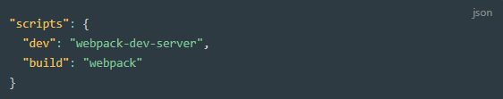

# 7. 웹팩 데브 서버

Created By: 홍익 안
Last Edited: Nov 24, 2020 4:37 PM

웹팩의 빌드 대상 파일이 변경 되었을 때 매번 웹팩 명령어를 실행하지 않아도 코드만 변경하고 저장하면 웹팩으로 빌드한 후 브라우저를 새로고침해준다.

명령어 치는 시간 + 브라우저 새로고침 시간만이 아니고, **웹팩 빌드 시간 또한 줄여주므로** 필수로 사용된다.

웹팩 데브 서버는 일반 웹팩 빌드와 다르다.

웹팩 데브 서버를 실행하여 빌드하는 경우, 결과물이 파일 탐색기나 프로젝트 폴더에서 보이지 않는다. 

웹펙 데브 서버로 빌드한 결과물은 메모리에 저장되고 파일로 생성하지 않기때문.